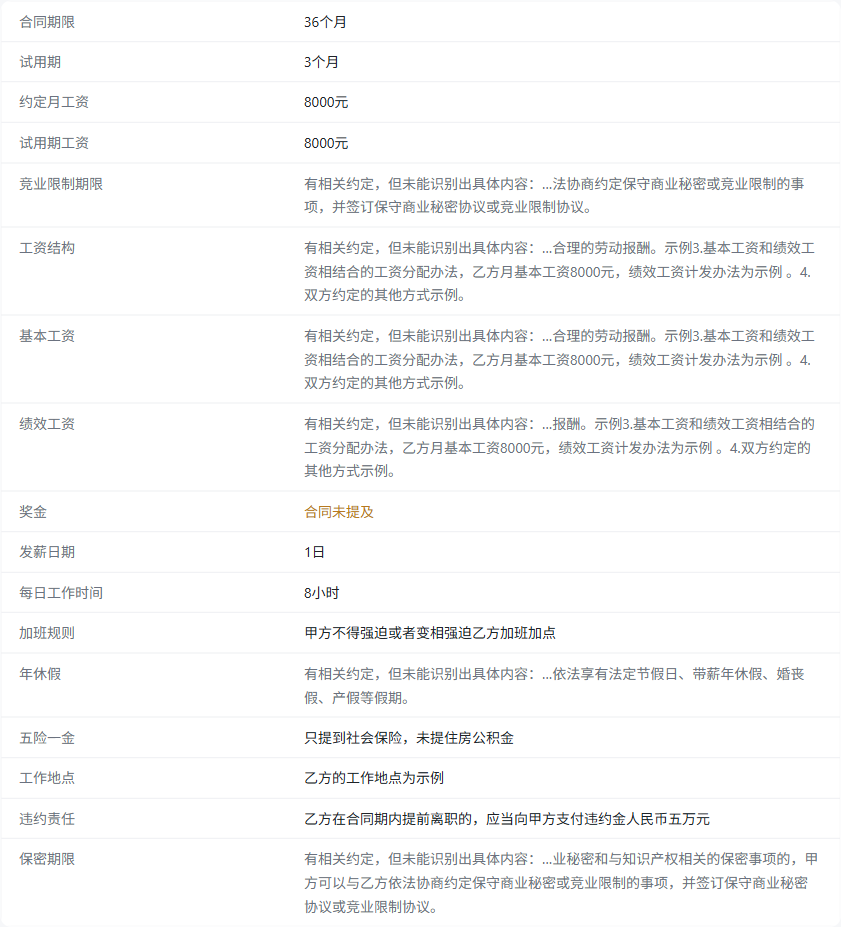

# labor-contract-annotator

**在线演示：<https://codeding-101.github.io/labor-contract-annotator/>**（打开即用，不需要安装，也不用注册）

> 本地化、开源的劳动合同风险检查工具。把当地人社部门的官方示范文本作为基准，逐条比对你的合同，指出可能违反法律规定的条款并附上对应的法律条文。
> **文件不离开你的设备。**

面向应届生秋招签约场景。设计文档见 [`docs/product-design.md`](docs/product-design.md)。

---

## 当前进度

| 层 | 状态 |
|---|---|
| 产品设计 | 完成，见 `docs/product-design.md` |
| 法条数据层 | 完成（v0）：3 部法律（劳动合同法 98 条、劳动法 107 条、社会保险法 98 条），均双来源交叉校验 |
| 范本库 | 完成（v0）：1 份官方范本，10 章 25 条，90 处填空位 |
| 范本比对引擎 | 完成（v0）：三级对齐 + 四类差异，5/5 已知答案用例通过。**只作为评测闸门存在，不在报告里展示**（理由见下） |
| 事实抽取层 | 完成（v0）：确定性抽取 16 项事实，抽不到显式标为「未识别」 |
| 规则库 + 规则引擎 | 完成（v0）：10 条规则、36 条自带用例；法条依据由校验强制 |
| 案例语料 | 完成（v0）：3 份案例文档共 25 个案例，为规则提供带裁判结果的真实措辞 |
| 标注与报告 | 完成（v0）：只做标注不给评分；报告组装＋文本渲染；示例合同自检零标注；关键信息 17 项全部取真值 |
| 网页端 | 完成（v0）：纯前端应用，粘贴文本、上传 PDF 或 .docx；已在不同内核与不同设备上打开验证 |
| 部署 | 已上线：<https://codeding-101.github.io/labor-contract-annotator/>（推送 `main` 自动构建部署） |
| 文件格式 | 按设计只支持**带文字层的 PDF** 与 **Word（.docx）**（可粘贴、可上传、可拖入）；老式 `.doc` 与扫描件／拍照件**明确不做**，界面会说明原因并给出替代做法 |

---

## 为什么不用大模型直接做

因为风险判断需要可复现、可解释、可测试，而模型输出做不到。这个项目的核心是**确定性引擎**：把官方示范文本结构化，与合同逐条对齐，产出可追溯的标注与法律依据。大模型只在最后一层可选地承担语义模糊判断，且**不负责输出法律条文**——条文一律从本地库取。

## 官网范本比对为什么不在报告里展示

最初的设计里，报告有一整栏「与官方范本的差异」（范本有合同没有／合同有范本没有／被改写／填空位留空）。做出来之后发现这个栏目对目标用户没有用，而且有误导性：大企业普遍在人社局范本之外附加自己的规章制度，于是"合同有、范本没有"会大量命中——那些附加内容未必违法，甚至多半是正常的管理条款，却会把真正该看的东西淹掉。

所以这条链路退到幕后：**比对引擎仍然存在，但只作为评测闸门**（`npm run eval:diff` 用真实范本数据验证四类差异都能被正确识别）。报告只回答"合同里哪里有值得看的东西、依据是哪一条"。

现在这一版从法条数据一路做到了网页端上线。

---

## 目录结构

```
sources/           官方页面/附件的冻结快照（提交进仓库，不手改）
  sources.json     法条来源声明：URL、发布机关、抓取日期、角色（主来源/交叉校验）
  templates.json   范本来源声明：URL、发布机关、发布日期、行政区划代码、容器格式
  labor-contract-law/
    samr.html      国家市场监督管理总局（主来源）
    xjbh.html      博湖县人民政府（交叉校验来源）
  labor-law/
    npc.html       中国人大网（主来源）
    samr.html      国家市场监督管理总局（交叉校验来源）
  social-insurance-law/
    govcn.html     中国政府网（主来源）
    chinatax.html  国家税务总局法规库（交叉校验来源）
  templates/liangzihu/
    labor-contract-general.html   梁子湖区人社局《劳动合同（通用）》
data/statutes/     构建产物：结构化法条（不入库，由 sources/ 复现）
data/templates/    构建产物：结构化范本（不入库，由 sources/ 复现）
src/
  cn-number.ts     中文数字转整数（第九十八条 → 98）
  html.ts          HTML → 按文档顺序的文本块
  mark-blanks.ts   把范本里「下划线包住空白」的填写位标成 {{FILL}}
  read-doc.ts      读取 Word 97-2003 二进制 .doc（纯 JS，不依赖本机 Word）
  normalize.ts     跨来源比对用的归一化（全角标点、空白）
  schema.ts        statute / riskRule / contractTemplate 三类数据的 schema
  extract-statute.ts   文本块 → 法条（条号连续性、前言、页脚边界）
  extract-template.ts  文本块 → 范本（章节/条文/注意事项/正文边界）
  extract-cases.ts     文本块 → 案例（序号/标题/案情/结果/评析，兼容三种文档形态）
  extract-facts.ts     从合同条款确定性抽取事实（抽不到即 null，绝不当成 0）
  rule-engine.ts       在条款上跑规则库，产出风险项与无法判定项
  load-statutes.ts     载入法条库，供引擎按 ID 取条文原文
  diff-template.ts     范本比对：三级对齐 + 四类差异（只作评测闸门，不进报告）
  build-report.ts      组装报告（关键信息、三段总结、免责声明）
  render-report.ts     报告渲染成纯文本（网页端复用同一份报告数据）
  build-statutes.ts    法条构建入口
  build-templates.ts   范本构建入口
  build-cases.ts       案例构建入口
  validate-data.ts     产物校验（条号/ID/哈希/法条与案例引用）
  diff-sources.ts      逐条对照各来源文本，供人工复核差异
  eval-diff.ts         评测：四类差异、真实数据上的事实抽取、范本零误报、报告自检
  report-sample.ts     打印示例报告（合规版 / 注入问题版）
tests/             node:test 单测
web/               纯前端网页（Vite + React），把 src/ 下的引擎原样跑在浏览器里
tmp/               本地临时脚本（已 gitignore）
```

---

## 快速开始

```bash
npm install
npm run build:statutes     # 快照 → data/statutes/*.json，并跑断言与交叉校验
npm run build:templates    # 快照 → data/templates/*.json
npm run validate:data      # 校验产物：条号连续、ID 一致、快照未被改动
npm test                   # 单测
npm run typecheck          # tsc --noEmit
npm run check              # 上面四项串起来

npm run eval:diff          # 用已知答案的合同评测比对引擎
npm run report:sample      # 打印两份示例报告（合规版 / 注入问题版）
npm run build:web          # 构建网页端（需先在根目录构建法条与范本数据）

npm run diff:sources -- labor-contract-law        # 列出各来源不一致的条文
npm run diff:sources -- labor-contract-law 63     # 只看第 63 条的逐来源文本
```

---

## 数据管线的三个机制

**1. 快照冻结 + 内容哈希。** 不直接抓线上页面生成数据——页面会变，那样产物不可复现。先把官方页面存成快照提交进仓库，构建时记录每个快照的 SHA256，写进产物的 `provenance`。`validate:data` 会重算哈希，快照被改动过就报错，逼你重新构建。

**2. 双来源交叉校验。** 同一部法律取两个独立官方来源，归一化标点与空白后逐条比对。主来源要求抽取干净（条号连续、无抽取问题），交叉来源不要求——它存在的意义就是暴露主来源的问题。差异条号会被记录并打印，供人工复核。

三部法律当前的结果：**劳动法 107/107 一致、社会保险法 98/98 一致**；劳动合同法 97/98 一致，唯一差异是第 63 条（某个来源多一个前引号，属源页面转录缺陷，故意保留不修）。交叉校验也抓过自己的 bug——社会保险法一度少一条、伪造出 13 处差异，根因是空白类 HTML 实体没解码（见下表第 7 项）。

**3. 结构断言。** 条号必须严格连续（从第一条开始，遇到断号立即停止并报错，宁可少收不可错收）；条文正文不得过短；条文 ID 与条号必须一致。主来源断言失败时**跳过写出**，不产出可疑数据。

---

## 范本库：把"填空位"变成可比对的信号

范本正文里到处是待填写位（`第 种方式`、`年 月 日`、`元`）。它们的原始形态是 **Word 下划线包住一串不换行空格**：

```html
<u><span>&nbsp;&nbsp;&nbsp;&nbsp;</span></u>
```

这是结构性信号，比数空格可靠——实测该范本 145 个下划线段落里 144 个内部只有空白，唯一含真实文字的那个被"内部为空"这个条件自然排除。抽取时把它替换成 `{{FILL}}` 标记，**相邻的多个下划线段会合并成一个**：Word 常把一条下划线拆成多个 run（`{{FILL}}{{FILL}}{{FILL}}年`），它们本来就是同一个填写位。不合并的话填充后会得到「示例示例2026年」，日期类模式就匹配不上——合并后该范本从 143 个标记降到 90 个。

**这个标记是对接比对引擎的接口，不是装饰**：比对范本与用户合同时，`{{FILL}}` 必须当作通配符。否则用户把内容填好的合同，每一处填空都会被判成"关键条款被改写"，误报率会高到不可用。正确做法是把范本条款编译成正则（`{{FILL}}` → `.+?`）。

范本抽取还多一层法条没有的判定——**哪些块属于正文**。范本里"注意事项"和附件同样用「一、」「二、」编号，形状上和章节标题一样。这里用**前视规则**解决：一个「X、…」块只有在它之后、下一个「X、…」块之前出现了「第X条」，才算章节标题。实测这条规则干净地排除了注意事项与两个附件。正文的结束则靠签署栏与页脚标志词判定。

## 比对引擎：三级对齐，四类差异

> 这一层现在**不出现在报告里**，只作为 `npm run eval:diff` 的评测对象。原因见上面「官网范本比对为什么不在报告里展示」。

范本与合同逐条比对。对齐从最确定的往下退，每一级都记录"这两条是怎么配上的"，报告里可以展示给用户看：

| 级别 | 依据 | 为什么需要 |
|---|---|---|
| 1 | 模式匹配 | 范本条款编译成正则（`{{FILL}}` → `.+?`）后整条匹配。对改写过的企业合同、重新编号都稳 |
| 2 | 条号相同 | 模式没匹配上时按条号配对 |
| 3 | 相似度 | 前两级都不行时，取二字符组 Dice 系数最高且过阈值的一条 |

分类决策树：对不上任何范本条款 → 缺失（范本侧）或多条（合同侧）；对上了但该填的空位还空着 → 填空留白；对上了但不符合范本模式 → 条款被改写；其余为一致。

## 评测：用"已知答案"的合同验自己

这是我认为这个项目最该被看到的部分。评测工具从范本自身派生五份合同，每份都有已知答案：

| 用例 | 期望 |
|---|---|
| 填空位全部填好 | 无差异，25 条全部对上 |
| 留空一处 | `BLANK_LEFT` ×1 |
| 删掉一条 | `MISSING_IN_CONTRACT` ×1 |
| 多出一条违约金条款 | `EXTRA_IN_CONTRACT` ×1 |
| 改写一条 | `MODIFIED` ×1 |

不只比对分类计数，还要求命中的正是被改动的那一条。`npm run eval:diff` 是 `npm run check` 的一部分，任何用例判错都会让构建失败。

**它第一次运行就抓到一个真 bug**：「填空位全部填好」这个最该零差异的用例，有 6 条被判成了"条款被改写"——正好是含填空位的那 6 条。原因是归一化会把文本转小写，`{{FILL}}` 变成 `{{fill}}`，而切分用的是大写标记，于是切不开、整段标记被当作普通文本转义进了正则。

这个 bug 靠读代码很难发现，靠真实合同也很难定位（容易误以为是自己解析错了）。**用已知答案的输入去测，是唯一便宜的发现方式。**

## 规则库：每条规则自带法律依据和正反例

比对引擎回答"这份合同和官方范本哪里不一样"，规则库回答"这份合同哪里违反法律"。两者的证据链不同：差异是算出来的，风险必须能追到具体条文。

规则库是**手工编写并提交进仓库的**（不是从快照构建的产物），有两条硬约束由 `npm run validate:data` 强制执行：

1. **每条规则的 `statuteRefs` 必须指向法条库里真实存在的条文 ID。** 引用不存在的条文，校验直接失败。这是把"规则不允许没有法律依据"从原则变成机制。
2. **规则里不复制法条原文。** 报告要展示哪条就按 ID 从法条库取哪条——条文只有一份来源，不会出现规则库里抄错条文却没人发现的情况。

每条规则还**自带正反例**（`cases`），`npm test` 会逐条跑过。改规则必须同时改用例，否则测试失败。当前 10 条规则、36 条用例，其中 4 条标注了来源案例。

## 案例语料：用真实措辞验证规则

企业劳动合同不会公开流传，所以"用真实合同验证"这条路走不通。但它有替代品：**人社部与各级法院公开发布的典型案例**——案例会原文描述企业与劳动者之间的约定，而裁判结果就是标签。

目前收了 3 份：**最高人民法院 2025-08-01 发布的典型案例**（6 个）、**安徽省高院／省人社厅／省总工会 2026-04-30 联合发布的典型案例**（9 个）、**2024年北京市劳动人事争议仲裁十大典型案例**（10 个）。走的还是同一套管线：冻结快照 → 抽取（案例序号／标题／案情／结果／评析）→ 结构化入库，带哈希与出处。

三份文档的排版差别不小，抽取器三种都吃下了：

| | 最高法那份 | 安徽那份 | 北京那份 |
|---|---|---|---|
| 案例标题 | 「案例一」单独成块，标题在下一块 | 「案例一：标题」内联 | 「案例1.标题」**粘连在同一块** |
| 目录 | 条目带冒号，正文不带 | **条目与正文形态完全相同** | 编号目录（一、二、…），不与标题冲突 |
| 小标题 | 【基本案情】【裁判结果】【典型意义】 | 判例类同上；仲裁调解类用【基本情况】【处理过程】【处理结果】 | 不带【】：案情简介／仲裁请求／处理结果／案例评析／仲裁委员会提示 |

两个关键处理：目录**不能靠标点区分**（各家形态相反），改用前视规则——正文案例在下一个案例标题之前会出现小标题，目录条目不会（与范本章节识别同一个技巧）；**序号以出现位置为准**，文档自带的序号只做交叉校验，这样缺号与顺序错乱都能抓到，也能兼容根本不给序号的文档。

它的价值不在语句数量，而在**措辞的真实性**。接入当天就抓出两处漏报：

| 缺口 | 案例里的真实措辞 | 原来为什么漏 |
|---|---|---|
| 社保规则漏报（第一种） | 「不为朱某缴纳社会保险费，而是将相关费用以补助形式直接发放」 | 关键词写死了「不缴纳社会保险」，中间插了当事人姓名就匹配不上 |
| 社保规则漏报（第二种） | 「社会统筹部分单位承担固定数额900元……不足部分由个人承担，从工资中扣除」 | 这条是**把义务转嫁给劳动者**，不出现"不缴"字样，同一规则的另一种失败形态 |
| **整个风险类型缺失** | 「对于发放数额如有异议应在3日内书面提出；未在…3日内提出书面异议的，均视为…已结清没有异议」 | 不是关键词漏报，而是**规则库里根本没有这一类**——工资异议期约定。北京案例三裁定该约定无效（依第二十六条），于是新增一条规则，法条依据现成 |
| 中文数字缺「两」 | 「离职后两年内不得从事同类业务」 | 数字表里只有「二」没有「两」，而合同里「两年」「两个月」极常见 |

三处修法都不是加特例，而是补上通用那一层：社保规则加了 `params.about`（要求条款"是关于社会保险的"，再在条款内匹配否定／转嫁表述），数字表补上「两」；第三处是新增规则而不是修补关键词——**真实材料能暴露的不只是"写法没见过"，还有"这一类我根本没想到"**。

**放宽关键词最怕反手制造误报**，所以 `eval:diff` 里加了一道闸门：把规则跑在**官方范本派生的示例合同**上，要求报出 **0 条风险项**——范本本身是合规的，报出来就说明关键词宽过头了。当前结果：风险项 0、无法判定 1（竞业限制条款没写期限，正确地判为无法判定）。

真实材料还能暴露**反向**的问题——误报。接入一份福州人社局的《新就业形态劳动者劳动合同参考文本》（.docx）时，规则在官方范本上报出了 2 条严重风险，逐条核对后都是误报：

| 误报 | 命中的其实是什么 | 修法（有原则的判据，不是无脑收紧关键词） |
|---|---|---|
| 扣押证件或收取财物 | 一条**投诉渠道**条款：它说的是「可以投诉他人收取保证金」 | 排除词加上「投诉／申诉／举报」——条款主题是申诉渠道，本身不是收费约定 |
| 约定由劳动者承担违约金 | 那份文档的**甲乙双方是两家公司**（互联网平台企业与平台用工合作企业），劳动者是第三方「乙方员工」 | 排除词加上「乙方员工」——真正的劳动合同里乙方是劳动者，不会有员工 |

两条都补了带说明的规则用例。**第 2 条的判据是通用的**：「乙方员工」这个称呼本身就说明乙方是企业。

规则用例可以标注 `source: "<文档ID>-C<序号>"`，**`validate:data` 会校验该案例真实存在**——真实措辞必须能追到出处。

判定方式有五种，全部已实现：`PATTERN_MATCH`（关键词命中，带例外排除——例如"竞业限制的违约金"是法定允许的）、`EXISTENCE`（必备条款存在性）、`NUMERIC_COMPARE`（与固定值比较，如竞业限制期限 > 24 个月）、`RATIO_COMPARE`（与另一事实的比例比较，如试用期工资 < 月工资 × 0.8）、`TIERED_COMPARE`（上限取决于另一事实，如法定试用期上限随合同期限分档）。新增判定方式时，引擎里的穷尽性检查会让 TypeScript 直接编译失败，不会静默漏掉。

**一个有意为之的取舍**：命中含「不得」「禁止」这类否定词的条款时，引擎不抑制命中，只加一条"请人工确认"的提示。因为漏报比误报严重——"乙方不得提前离职，否则支付违约金"里也有"不得"，但它确实是违法条款。

## 事实抽取：把"写着的数字"变成可判定的输入

两类地方要用到它：数值类规则（试用期超长、试用期工资低于 80%、竞业限制超过两年）要拿合同里的数字去和法条比对；报告里的「关键信息」表也要把 17 项内容填成可核对的值。这一步是纯确定性的（正则 + 中文数字换算 + 多选项消歧），不调用模型——值错了结论就跟着错。

**抽取原则：标签锚定 + 合理性检查，绝不"按形状猜"。** 这条不是设计出来的，是被真实材料打穿三次换来的（见下方"真实世界打穿记录"）。

四条设计约束：

1. **抽不到就是 `null`，不是 0，也不算合规。** 依赖它的规则产出 `UNDETERMINED`（无法判定），与"违规""合规"并列成为第三种结果。规则用例里的 `expect: "UNDETERMINED"` 专门测这条：合同只写了试用期、没写合同期限时，规则必须拒绝下结论。
2. **先按标签定位，再取值：** 「试用期工资：4800 元」取标签后第一个金额，且不越过标点。曾经用"这一条里最后一个金额"这种按位置的启发式，在一句话含四个金额的真实合同上把试用期工资取成了绩效工资 1500 元。
3. **多选项条款先消歧再抽。** 范本大量使用「按下列第 1 种方式……1.……2.……3.……」。带「第 N 种」的条款要拆成"被选中的那一项 + 选项清单之前的共用文字"，**绝不把没被选中的选项算进来**——否则会把没选的发放方式里的数额报成约定工资。
4. **值域检查兜底：** 发薪日 1–31、每日工时 1–24、年休假 1–60 天、保密期限 1–600 个月，越界一律拒绝。真实合同里「本岗位不约定竞业限制义务」那句话旁边有个 2026 年的日期，旧实现把它当成"2026 年的竞业限制期限"，算出 24312 个月。

文本类事实（工作地点、加班规则、违约责任、五险一金）没有可比较的数值，取值就是合同原文的**整句**——遇到句号、分号、换行就停，不跨句截取。摘出来的原文本身就是"核对内容"，比"有提及（未核对内容）"有用得多。

在真实范本派生的示例合同上实测抽出 9 项真值（合同期限 36 个月、试用期 3 个月、月工资 8000 元、发薪日期、每日工时 8 小时等），其余 6 项范本自己就没给数额（例如"依法享有带薪年休假"而不写天数），报告如实标成「有相关约定，但未能识别出具体内容」并附上原文。这条检查放在 `npm run eval:diff` 里，且刻意**不用我手写的测试夹具、而用真实范本数据**——"相邻填空位没合并"的 bug 就是它抓到的（手写夹具里日期是完整的，掩盖了问题）。

## 真实世界打穿记录

下面每一条都是真实材料先打穿、再修的——不是假想的边界情况。前四条来自作者拿自己的劳动合同实测。

| # | 现象 | 根因 | 修法 |
|---|---|---|---|
| 1 | 「试用期工资：人民币 4800 元/月，试用期满转正工资：6000 元/月，包含基本工资 4500 元、绩效工资 1500 元」→ 试用期工资报成 **1500** | 按位置猜：取"这一条里最后一个金额" | 改成标签锚定（`amountAfterLabel`），并**删掉**没有标签时的位置兜底——宁可报未识别，也不能拿绩效工资当试用期工资（它还连带把 80% 那条规则判成误报） |
| 2 | 「工资支付方式：甲方于每月 15 日……发放上月工资」→ 发薪日期报「合同未提及」 | 关键词表只有「发薪／支付日期／发放日期」 | 补关键词，但根治是把它升级为真值抽取（每月 X 日） |
| 3 | 「本岗位不属于……涉密岗位，不约定离职后竞业限制义务」→ 竞业限制期限报成 **24312 个月** | `(数字)年` 匹配到了同一条款里 2026 年这个**日历年份**，2026 × 12 | 四位数字落在 1900–2200 一律按日期处理；显式"不约定竞业限制"直接判为未识别 |
| 4 | 一份 PDF 提取出满篇"斜着的 SOH" | 字体编码把字形映射成了控制字符，本地无法还原 | 剥掉控制字符，并把控制字符占比与 CJK 占比作为"这份文件读不出文字"的判据——**不给一份满篇错字的报告** |
| 5 | 一份 4 页的正常合同被判「读不到文字（提取出 2505 字）」 | 第 4 条的判据用的是**控制字符总占比**，而这份 PDF 每一行末尾都带一个 SOH（占总字符 4%）——那是生成器噪声，不是字形坏掉 | 判据改成只看**夹在正文中间**的控制字符；粘在行首/行尾的剥掉即可 |
| 6 | 同一份 PDF 里「甲⽅」「⼈⺠」看着正常，但一条规则都匹配不上 | 字体把字形映射到了康熙部首（「⽅」是 U+2F45，不是 U+65B9「方」）与部首补充区（「⺠」是 U+2EA0） | 按 Unicode UCD 的等价映射修回统一汉字（康熙部首走 NFKC，补充区查表，见 `src/cjk-radicals.ts`）。**不修的话事实抽取会静默全部落到"未提及"，比报错危险得多** |
| 7 | 合同期限 2026-09-15 至 2029-09-14 被判成 **35 个月** | 按"经过时长"算，没考虑「自 X 起至 Y 止」是**含首尾两天**的期间 | 终止日按含当天计算 → 36 个月。否则会落进「一年以上不满三年」那一档，把合法的 6 个月试用期误判成超长 |
| 8 | 月工资报成 **200 元**（实际是 6000 元） | 同一份合同里「转正」第一次出现在「不低于转正工资 80%」后面，那里没有金额，于是整条放弃、退到别的条款抓到了「每月 200 元餐补」 | 标签出现多次时逐个试，取第一个后面确实跟着金额的 |
| 9 | **Word 路径完全没走文本质量管线** | 质量自检只写在 PDF 读取器里，`.docx` 只判断了长度 | 读取器只产出文本，"修复 + 能不能用"统一收到一处（`web/src/document.ts`）。**只在一条路径上做，等于给另一条路径埋静默错误** |
| 10 | "仅提及"的摘录摘到章节标题（「四、违约责任」「二、合作期限」），`违约责任` 的值一度就是标题本身 | 按关键词出现顺序取，而关键词常常先在标题里出现 | 标题不算内容（`looksLikeHeading`）：文本类事实跳过标题；"仅提及"取**命中本行关键词最多**的那句，同样多时取最短 |
| 11 | 新就业形态合同里"发薪日期"判「未提及」 | 关键词表只有「工资／发薪／支付」，而这类合同通篇写「劳动报酬」「结算支付」 | 补真实写法。这类问题在第 2 条已经出现过一次——**关键词表只能靠真实材料长**，想不出来 |
| 12 | 把 `.doc` 改成 `.docx` 的文件报 `Can't find end of central directory` | 把库的英文异常原样抛给用户 | 转成可操作的提示：「请在 Word 里打开后另存为 .docx 再试」 |

| 13 | 合同写着「不约定离职后竞业限制义务」，报告却出现「无法判定：竞业限制期限超过两年——合同明确不约定竞业限制义务」 | 事实层把"明确不约定"和"没认出来"都归成 `UNRECOGNIZED`，引擎据此一律产出"无法判定" | 加 `NOT_AGREED` 这一档：明确不约定的，规则判为**不适用**（不报违规，也不列进"无法判定"），关键信息里直接显示这句话本身 |

第 1 条和第 3 条都属于同一类错误：**按形状猜**。所以抽取原则被改写成"标签锚定 + 合理性检查"：每个值都必须由一个明确的标签引出，且必须落在物理上可能的范围内。第 6 条则说明另一件事：**"能读出字"不等于"读到的是对的字"**——错误的码位比乱码更阴险，因为它看起来完全正常。第 13 条说明第三件事：**"没查出来"和"查了、结果是本项不约定"必须分开**，把确定的事说成不确定，是另一种失真。

## 报告层：只做标注，不做评价

引擎的输出（标注项、无法判定项、事实）在这里组装成一份用户能看的报告。三条设计约束：

**1. 不给综合评分，也不给签署建议。** 早期版本有过一个评分（红 15／黄 5／蓝 1、高危一票封顶 40），后来删掉了。原因是两条：**权重是拍脑袋定的**（我当时就在文档里注明"这不是法律或行业标准"）；更根本的是，**一个宣称"不构成法律意见"的工具，却在最显眼处给出一个综合打分，本身就是矛盾的**。

标注等级（严重／需关注／提示）保留——它是"这条属于哪一类"的分类，而且每条都有法条依据可查；而"这份合同 40 分、建议别签"是替用户下结论。现在报告顶部只给纯计数，并明确写着：**本工具只把合同里的条款标出来、附上对应的法律条文，不做综合评价，也不替你决定签不签。**

这条定位有测试钉住（`tests/build-report.test.ts` 断言报告里不含 `score` 与 `recommendation` 字段），防止以后又加回来。

**2. 无法判定的项单独成块，不算合规也不算风险。** 它们不计入标注数——没抽到信息既不该算"有问题"也不该算"没问题"，但必须在报告里明确列出来。这是事实层那条约束（抽不到就是 `null`）在报告层的延续：用户需要知道"这条我没能判断"，而不是以为已经查过了。

**但"合同明确写了本项不约定"不算无法判定**：那是确定的结论，规则直接判为**不适用**。合同里写着「本岗位不属于企业高管、核心技术及涉密岗位，不约定离职后竞业限制义务」时，报告不该出现「无法判定：竞业限制期限超过两年——合同明确不约定竞业限制义务」这种自相矛盾的条目；它现在显示在关键信息里：「竞业限制期限 → 合同明确不约定竞业限制义务」。这一条是拿作者自己的真实报告看出来的。

**3. 关键信息 17 项全部取真值，取不到值就摘原文。** 状态有四种：`有值`（抽到数值，带单位）、`原文`（文本类事实，值就是合同原句）、`有相关约定但未识别出内容`（附原文片段供人工核对）、`合同未提及`。这里原先有 11 项只做关键词存在性判断、显示成"有提及（未核对内容）"——等于什么都没说，而且关键词表覆盖不到真实写法时还会误报"合同未提及"。**"合同未提及"本身就是一条提示**（法定必备条款缺失的另一种视角）。



`npm run report:sample` 会把这份报告打印出来，看的是两份：官方范本派生的合规示例（应当零标注），以及往里面注入三条典型问题条款后的版本。它同时兼任自检。

这些不是假想的边界情况，是这一版真实撞上并处理的：

## 网页端：粘贴文本就能出报告

`web/` 是一个纯前端应用（Vite + React + TS）。它把仓库根目录 `src/` 下的引擎模块**原样**接进来跑——这些模块不依赖任何 Node API，浏览器里能直接用，这也是"合同内容不离开设备"能成立的前提。

打开后能做三件事：

- **粘贴合同内容 → 出报告。** 条款编号可有可无：认得出「第X条」就按条切分（**不校验连续性**——跳号是对方合同的写法问题，不该让整份分析失败），一条都认不出就退化成"一段即一条"，并在结果上方如实说明用了哪种方式。
- **文件可以直接拖进来。** 对方发来的合同多半就是桌面或聊天窗口里的一个 `.docx`，拖放比找按钮快；拖拽时输入区会高亮并提示"松开鼠标即可读取这个文件"。
- **填入合规示例 / 填入可疑示例。** 前者用官方范本填空题生成一份合规合同；后者在它之后追加三条**取自真实案例**的问题条款（违法违约金、约定放弃社保、工资异议期）。
- **结果页按信息层级排**：标注计数概览 → 标注的条款（每条含合同原文、风险说明、判断依据、法条原文、建议）→ 无法判定 → 关键信息 → 三段总结 → 免责声明。


- **输入方式**：三路——直接粘贴文字、上传**带文字层**的 PDF、或上传 Word（.docx）。读不出文字时界面会明确说明原因并给出替代做法，**不会给出一份空报告**。
- 两种文件格式走**同一条文本质量管线**：读取器只负责"文件 → 一行一段的文本"，码位修复、控制字符清洗、"能不能用"的判定统一放在 `web/src/document.ts`，不分散到各读取器里——只在一条路径上做，等于给另一条路径埋静默错误（Word 路径一开始就是这样漏掉的）。
- 文件读不出来（加密、损坏、把 .doc 改了扩展名）时给的是**可操作的提示**，不是原样抛出库的英文异常。

- 各格式的读取器都在 `web/src/document.ts` 里统一分发，并且**按需加载**（主包 148 KB gzip，PDF 与 Word 的解析代码各自单独成块）。
- PDF 走 `pdfjs-dist`，在浏览器里按**坐标重组行**：PDF 里没有"段落"概念，只有一堆带坐标的文本片段。同一行的片段 y 相同，按 x 升序拼接；PDF 坐标原点在左下，所以 y 越大越靠上。拼接时只在两侧都是英文字母数字时才插空格——中文合同里的空隙多是排版产物，乱插会把「劳动合同」切成「劳动 合同」。
- **提取出的文字还要过一道码位修复。** 中文字体（多见于 PDF 导出）会把字形映射到部首码位：`甲⽅` 的 `⽅` 是康熙部首 U+2F45，不是「方」U+65B9。这类文本**看着完全正常**，但拿它匹配「甲方」永远匹配不上，事实抽取会静默地全部落到"未提及"。修复方式是查 Unicode 的等价映射表（`src/cjk-radicals.ts`，出自 UCD 的 `EquivalentUnifiedIdeograph.txt`）把码位修回统一汉字；只动部首与兼容汉字区块，**不做整篇 NFKC**——那会把全角标点也改掉，报告里引用的合同原文就不原样了。
- Word 走 `mammoth` 的 `extractRawText`：它把每个段落输出成一行，正好是引擎期望的形态。这里刻意不要 HTML——对"比对条款文字"这个目的，段落文本就够了，少一层解析就少一层出错的地方。
- 坐标重组那段逻辑放在引擎的 `src/text-lines.ts`（纯函数、有单测），`web/` 只负责库的接线。**将来接 `.doc`、OCR 时，只要它们能产出"一行一段"的文本，就能复用同一条链路。**

浏览器实测覆盖（桌面 1280×900 + 移动 390×844）：

| 验证项 | 结果 |
|---|---|
| 上传真实 PDF | 一份 4 页的劳动合同（合法标准版）：提取 2505 字 → 识别 12 条 → 0 条风险、1 项无法判定；关键信息 9 项取到真值（合同期限 36 个月、约定月工资 6000 元、试用期工资 4800 元、基本工资 4500 元、绩效工资 1500 元、发薪日期 15 日、每日工时 8 小时、工作地点、工资结构） |
| 上传公开 PDF | 一份 24 页的中文 PDF（政府公开文本）→ 提取 10797 字 → 识别出 98 条 → 出报告，无崩溃 |
| 上传真实 .docx | 福州人社局的《新就业形态劳动者劳动合同参考文本》→ 327 段、16340 字 → 识别 105 条 → 0 条风险（修掉两处误报后） |
| 上传真实 .docx（第二份） | 建筑工人简易劳动合同（示范文本）→ 69 段、3409 字 → 识别 9 条 → 0 条风险 |
| 上传"从 PDF 复制进 Word"的 .docx | 236 个部首码位被自动修回，抽出的数值与 PDF 版完全一致（36 个月、6000 元、4800 元、4500 元、1500 元、15 日、8 小时）；来源行会写明"修正 236 个错位字符" |
| 上传无文字层的 PDF | 明确报错（说明多半是扫描件/拍照件）、输入框保持为空、不给报告 |
| 上传只贴了图片的 .docx | 同上：明确报错并给出替代做法，不给空报告 |
| 上传损坏的 PDF / 把 .doc 改成 .docx 的文件 | 报错并给出可操作的下一步（"请在 Word 里打开后另存为 .docx 再试"），不给报告 |
| 上传 `.doc` 或拍照图片 | 按设计不支持：明确说明本工具只读**带文字层的 PDF 与 Word（.docx）**，并给出替代做法（另存为 .docx ／ 从原件复制或手工录入条款）；不给报告 |
| 合规示例 | 0 条风险、0 处差异，关键信息 9 项取到真值、6 项如实标成"有相关约定但未识别" |
| 可疑示例 | 3 条严重风险全部报出（违法违约金、约定放弃社保、工资异议期），法条原文正确展示（含《劳动法》第五十条、《社会保险法》第十二/六十条） |
| 无条款编号的文本 | 退化为按段落切分，规则与事实抽取照常工作 |
| 空态 | 「开始检查」禁用、清空后报告消失、提示文案正确 |
| 移动端 | 无横向溢出 |
| 控制台 | 无错误 |

（用来实测的 PDF 与 Word 都是政府网站上的公开文本，不是真实企业劳动合同——企业合同拿不到，这一点见"已知局限"。）

```bash
cd web
npm install
npm run build      # 产出 web/dist，纯静态，可直接托管
npm run preview    # 预览构建产物
npm run dev        # 开发模式
```

**构建前提**：网页端在构建期把 `data/statutes`、`data/templates`、`rules/` 直接打包进去，所以要先在仓库根目录跑一遍数据构建（`npm run check` 或 `npm run build:statutes && npm run build:templates`），否则 `web/` 构建会找不到数据。

## 部署：GitHub Pages

静态产物 + 一个 GitHub Actions 工作流（`.github/workflows/deploy-web.yml`）。推到 `main` 即自动构建并发布。

**两个必须处理的坑，都已处理并实测：**

1. **子路径基准。** 项目站点在 `/<仓库名>/` 下，而 Vite 默认产出绝对路径 `/assets/…`——直接部署上去资源会全部 404。`web/vite.config.ts` 里设了 `base: './'`，本地与任意子路径都能跑。这一点**实际验证过**：把 `web/dist` 挂到 `/labor-contract-guard/` 子路径下（模拟 Pages 布局），界面正常渲染、CSS 生效、PDF 的按需分块与 worker 也都加载成功。
2. **数据不入库。** `data/` 是构建产物（在 `.gitignore` 里），而网页端在构建期把法条/范本/规则打包进去。所以工作流先跑仓库根目录的 `npm run check`（它会构建数据并跑全部断言与评测），再构建网页端。**顺带让这个工作流兼任质量闸门**：数据、评测或测试挂了就不会部署。

另外放了 `web/public/.nojekyll`，让 Pages 跳过 Jekyll 处理。

### 首次发布要做的三步

仓库已推到 <https://github.com/codeding-101/labor-contract-annotator>，还差开启 Pages：

```bash
# 1. 仓库 Settings → Pages，把 Source 选成 "GitHub Actions"
# 2. 回到 Actions 标签页，选 "Deploy web to GitHub Pages"，点 "Run workflow"
#    （首次推送时 Pages 还没开启，那一次部署会失败，手动触发一次即可）
# 3. 等它跑完，地址是
#    https://codeding-101.github.io/labor-contract-annotator/
```

**注意两点：**

- **`git push` 必须走代理**。实测本机直连 github.com 会超时（Clash 的系统代理只对认它的程序生效，git 不认），而 GitHub 的 API 经代理又被 403 挡掉。所以推送时显式带上代理：

  ```bash
  git -c http.proxy=http://127.0.0.1:65532 -c https.proxy=http://127.0.0.1:65532 push
  ```
  （想省事也可以 `git config --global http.proxy …`，但那样国内仓库的访问也会绕道。）
- **提交邮箱必须是 GitHub 的 noreply 地址**，否则会被 GH007 拒绝（"Your push would publish a private email address"）。本仓库已设为 `322343797+codeding-101@users.noreply.github.com`（只改了本仓库，没动全局配置）。

## 隐私：不是声明，是浏览器替用户兜住的

"合同内容不离开设备"在这个项目里有三层证据，一层比一层硬：

**1. 代码层。** 全仓库没有任何 `fetch` / `XMLHttpRequest` / `sendBeacon` / `WebSocket`，也没有外部字体或 CDN 引用（一条 grep 就能复核）。文件是通过浏览器的 File API 读进内存的，从来不是"上传"。

**2. 策略层。** 生产构建会注入一条内容安全策略，其中 **`connect-src 'none'` 让浏览器禁止一切出网请求**（同域也不行），`default-src 'self'` 禁止加载任何外部资源。这意味着"不上传"不再依赖"我们没写上传代码"——即使将来有人 fork 后加埋点或上传，也会被浏览器挡下来。这条策略只在构建时注入，开发模式不注入（否则 Vite 的热更新会被一起拦掉）。

**3. 行为层。** 实测把整个会话的请求列出来——从打开页面、跑一次分析、上传 PDF、到上传 Word：

```
GET /labor-contract-guard/                         200
GET /labor-contract-guard/assets/index-*.js        200
GET /labor-contract-guard/assets/index-*.css       200
GET /labor-contract-guard/assets/pdf-*.js          200   ← 上传 PDF 时才懒加载
GET /labor-contract-guard/assets/pdf.worker.*.mjs  200
GET /labor-contract-guard/assets/docx-*.js         200   ← 上传 Word 时才懒加载
```

**一共 6 个请求，全部是同源静态资源**，没有一个发往外部，也没有任何 POST。

另外还直接在页面里试着发过一个跨域请求（`fetch('https://example.com/leak')`），被浏览器拦掉并报 `Failed to fetch`——**这条策略是生效的，不是写着好看**。

## 数据层实际发现并修掉的问题

| # | 问题 | 处理 |
|---|---|---|
| 1 | 博湖县页面把附则的章标题**误写成「第九章」**，并与第九十六条粘在同一个标题块里，导致第九十六条被整块当成章标题吞掉，抽取只剩 95 条 | 章标题块内若含条文，则丢弃该章号、按条文处理，章节沿用上一个有效章。修复后该来源恢复到完整 98 条 |
| 2 | 该页面**页脚**（网站地图、ICP 备案号等）紧跟第九十八条，被当作续段并入，污染了最后一条的正文 | 命中两个以上页脚标志词即判定正文结束，另行记录边界；不记为抽取问题（页脚是政务网站常态，不该让构建失败） |
| 3 | **只处理了「第X章」而漏掉「第X节」**，「第三节 非全日制用工」被当成续段并进了第六十七条的正文（出现在作为主来源、会写出货的数据里） | 增加节标题识别与 `section` 字段；换章时重置节层级。同时加了防御性断言：条文正文里出现以章节标题开头的行即报错，让这类漏处理暴露而不是静默污染 |
| 4 | 第六十三条第二款多一个前引号，两个来源因此不一致 | **不修**。这是源页面的真实转录缺陷，交叉校验如实报为差异，保留可追溯性 |
| 5 | 页面正文之前有修正决定与公布通知，其中含条号引用 | 只从「第一条」开始收集；之前的块全部记入 `preamble`，不静默丢弃 |
| 6 | 前言截断曾被记为抽取问题，会导致导航很多的官方页面让构建无谓失败 | 前言与页脚都只记录、不计入抽取问题；只有条文完整性问题才阻断构建 |
| 7 | **空白类 HTML 实体未解码**：税务总局那份社会保险法第 98 条实际是 `&ensp;第九十八条 …`，块首挂着一个未解码实体，`^第X条` 匹配不上，于是被并进第 97 条——来源少了一条，还额外伪造出 13 处"文字差异" | 补齐 `&ensp;`/`&emsp;`/`&thinsp;` 等实体，并对空白类实体名做兜底；修复后该来源 98 条、交叉校验 98/98 完全一致 |
| 8 | **页脚条目各自成块**：中国人大网与政府网的页脚把「编 辑：」「责 编：」「相关稿件」「【我要纠错】」等各放一块，原先"一个块里出现两个页脚词"的判定永远凑不够数，页脚被并进最后一条正文 | 增加"单块即可判定正文结束"的标志（含 `ICP备`/`公网安备`/`网站标识码` 这类正文不可能出现的字样） |

第 3 项是这一版最重要的修复：它出现在**要出货的产物**里，而且是被「克隆后逐条核对」这种笨办法翻出来的。第 4 项是唯一仍未收敛的差异，属已知来源缺陷。

---

## 已知局限

- **规则库 10 条，覆盖仍有限。** 已含文本类 6 条与数值类 3 条；"未依法缴纳社保""低于当地最低工资""加班费计算基数"等还需要先把社会保险法、工资支付暂行规定与地方最低工资数据入库，才能把规则绑到条文上。
- **事实抽取靠正则模式，写法覆盖是长尾。** 现有 16 个事实键覆盖了常见写法（月工资／转正工资／基本工资／绩效工资、每月 X 日发薪、每日工时、年休假天数、保密期限、工作地点、加班、违约金、五险一金），命中不了的会落到"未识别"或"有相关约定但未识别出内容"。这是有意的取舍：宁可报无法判定，也不拿猜出来的数字下结论。
- **文件格式的边界是有意划在这里的：只支持带文字层的 PDF 与 Word（.docx）**，不做老式 `.doc`、扫描件与拍照件。理由两条：`.doc` 是 Word 97-2003 的二进制格式（OLE 复合文档），浏览器端要读它得把这层解析搬进来，是独立的一块工程；扫描件与拍照件需要中文 OCR，而浏览器端没有可靠又免费的方案，硬撑只会给出准确率很低的识别结果——那正好违背这个工具"宁可报读不出来，也不给错报告"的取舍。这两种情况界面都会明确说明原因，并给出可操作的替代做法（另存为 .docx ／ 复制或手工录入条款）。
- **"甲乙双方都是企业"的文本会有偏差**。新就业形态（平台用工）那类合同/协议的甲乙双方是两家企业、劳动者是第三方，与本工具假定的"用人单位—劳动者"两方结构不同。已加了一条判据（「乙方员工」说明乙方是企业），但这类文档整体上仍可能触发不恰当的提示。
- **把非合同文本喂进来会误报**。实测把一份法律条文 PDF 放进去，"约定放弃社会保险"这条规则被命中了——因为法条正文里本来就写着"不缴纳社会保险费"这些字样。本工具假定输入是**劳动合同**；对法条、政策文件这类文本，关键词规则会产生误报。
- **没跑过真实企业合同**——企业劳动合同不公开。目前最接近的是作者自己构造的一份 4 页《劳动合同（合法标准版）》（含全套虚拟数据），它打穿了 5 条缺陷（见表），但虚拟数据终究是"照着范本写的"，不代表企业实际措辞。
- **界面样式是手写 CSS**，没有按设计文档的原计划引入 Tailwind + shadcn/ui——v0 为减少构建配置先手写，样式集中在 `web/src/styles.css`，要换随时可换。
- **标注等级仍是分类判断**（严重／需关注／提示）。等级来自规则本身的定义，不是从条款文本算出来的分数；但它依然是"这条更值得注意"的一种判断，而不是纯粹的事实陈述。
- **不做综合评价、不给签署建议**是有意为之。报告只回答"合同里哪里有值得看的东西、依据是哪一条"，签不签由用户判断。
- **报告只在范本派生的示例合同上自检过**（合规版零标注、关键信息必须取出值），没跑过真实合同——与下面那条验证来源限制同源。
- **社会保险法尚未入库**，所以"约定放弃社保"这条规则目前引用的是《劳动合同法》第二十六条（免除自己法定责任、排除劳动者权利），而不是社保法条文。这是数据缺口，不是设计选择。
- **界面已在多内核、多设备上打开过**（不同内核浏览器与不同设备均可正常打开）。但要注意这只证明"能打开并正常渲染"，**不等于文件上传路径在每个内核上都验过**——PDF 的按需分块与 worker、以及 `connect-src 'none'` 这条 CSP 在 Safari 下的行为，只有在那些内核上真正上传一次文件才算验过。
- **没有任何人真正用过它**。所有验证都是构造输入加上我自己点击，没有一个真实的毕业生拿它看自己的合同。界面上哪些地方看不懂、报告里哪些话说不通，只有让目标用户试过才知道。
- **验证来源仍有限（但有进展）**：企业劳动合同不公开，拿不到真实合同做验证。当前验证有四条：范本派生的已知答案用例、规则自带的正反例、法条双来源交叉校验、`eval:diff` 在真实范本数据上跑事实抽取；再加上**真实案例措辞**（见上），它已经抓出两处漏报。
  但这些拼起来仍**证明不了覆盖真实企业的措辞多样性**：1 份案例文档只有 6 个案例，而合同的写法是长尾。继续积累案例材料是唯一的办法，且需要人工找来源（`web_search` 在本机不可用）。
- **范本只覆盖 1 个地区**（湖北省鄂州市梁子湖区），且是省级以下的区级范本，不是省范本。
- **官方范本普遍是二进制 `.doc`**。北京、上海、广东、河南、沈阳、浙江、福州的范本基本都是 `.doc` 附件，网页正文里没有条款内容。`word-extractor` 已接入并能读出正文，但它对段落边界的还原不可靠（实测某市范本把"注意事项"六条连成一行），接入前需要先验证段落边界。`.docx` 需要另加读取器，尚未接。
- **法条库现有 3 部**（劳动合同法、劳动法、社会保险法）。还缺工资支付暂行规定、劳动争议司法解释与地方最低工资数据——"低于当地最低工资""加班费计算基数""经济补偿计算"这几类规则都卡在这里。
- **劳动合同法之外的两部法律尚未被规则引用殆尽**。劳动法第四十四条（加班费倍率）与第五十条（不得克扣拖欠工资）已接入规则依据，社会保险法第五十八条、第六十条也已接入；其余条文要等对应规则出现才有用。
- **没有条文坐标**。当前只抽文本，没有页码与位置信息；将来做报告页的原文高亮，PDF 路径需要补这层数据。
- **源页面瑕疵保持原样，不清理**：梁子湖区范本第三节混入一个孤立的「方」字；博湖县法条第 63 条多一个前引号。都选择与来源一致并记录下来。
- **页脚边界是启发式**（≥2 个标志词命中），不是通用 DOM 解析。换一类页面结构可能需要调整标志词表。
- **前言可能含页面导航噪声**（上限 40 段，超出只截断并记录实际段数）。前言只用于溯源，不影响条文。
- `LICENSE` 尚未添加（计划 Apache-2.0）。

---

## 设计要点提醒

本工具只做**事实比对与条文引用**，不做法律意见：不判断条款有效无效，不预测仲裁结果，不承诺覆盖全部风险。法条库的每条规则都必须能追溯到官方条文原文，追溯不到的规则不写。

## 关于完成方式

这个项目的代码、数据管线、规则库与文档是**与 Grok（xAI）结对完成**的：产品判断与边界由作者把握（不做综合评价、坚持数据不出设备、规则必须有可引用的法条依据），实现、验证与记录由 Grok 执行。

过程中的取舍与踩过的坑都写在这里和 `docs/` 里——包括几个不太好看的部分：误报、被自己写死的字符串漏掉的真实写法、以及一条原本以为"能自动识别"但实际做不到的 OCR 路线。

## 许可

计划采用 Apache-2.0，`LICENSE` 文件待添加。
